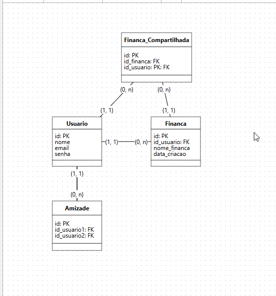

---

## 📅 Reunião: 30/10

### 🧑‍🤝‍🧑 Participantes
* Gabriel
* Daniel
* Brenda
* Guilherme
* Caio

---

## 📝 Revisão da Reunião Passada

### ✅ O que foi feito
* Terminar a Configuração do Repositório de Documentação (MkDocs).
* Estruturar as Tabelas (Reestruturado para modelagem do banco para **1ª onda**).

### ➡️ Adiado
* Criar o Markdown Guia (Conventional Commits/Gitflow).
* Criar o Banco de Dados (Implementação).

### ⏳ Para Fazer (Pendente)
* Criar o Banco de Dados (Implementação).
* Criar o Arquivo de Ambiente Padrão (`.env.example`).

---

## 🗣️ Reunião Atual: Discussão e Modelagem de Dados

### 💡 O que discutimos
Utilizamos a ferramenta **BRMW (site)** para fazer a modelagem do banco de dados, focando nas tabelas necessárias para implementar as *features* iniciais: **Cadastro de Usuário**, **Cadastro de Finança** e **Sistema de Amigos**.

#### 1. Cadastro de Usuário
* Concordamos que a tabela de usuário precisa apenas dos campos:
    * `id`
    * `nome`
    * `email`
    * `senha`

#### 2. Finanças: Dinâmica e Estrutura
* **Conceito de Finança:** Finança serve para agrupar o capital que o usuário tem e aplica para algo.
    * *Exemplo 1 (Conta):* Finança geral com todas as transações (`bolsa: 500`, `spotify: 10`).
    * *Exemplo 2 (Casa):* Agrupa transações relacionadas à casa, com capital disponível específico para essa finança.
* **Modelagem de Finanças:** Decidimos dividir a finança em duas tabelas para gerenciar o compartilhamento:

| Tabela | Campos | Observação |
| :--- | :--- | :--- |
| **`financa`** | `id`, `id_usuario`, `nome_financa` | Contém os dados da finança principal e seu criador. |
| **`financa_compartilhada`** | `id`, `id_financa`, `id_usuario` | Registra quem faz parte de uma finança compartilhada. |

#### 3. Sistema de Amigos
* Para a funcionalidade do sistema de amigos, apenas a tabela **`amizade`** é suficiente:

| Tabela | Campos | Observação |
| :--- | :--- | :--- |
| **`amizade`** | `id`, `id_usuario1`, `id_usuario2` | Gerencia os relacionamentos de amizade entre usuários. |

* Avaliamos que nenhuma das tabelas atuais gerará redundância.

### 🖼️ Ilustração da Modelagem

> A imagem abaixo ilustra a tabela e suas relações:
> 

>
> Caso queira ver com mais detalhes, entre no link: *https://app.brmodeloweb.com/#!/logic/%7B"modelid":"6904121e50b9738983aab30d","conversionId":""%7D)*

---

## 🚀 Próxima Reunião: Ações

| O que fazer | Responsável | Data Limite |
| :--- | :--- |:------------|
| Criar o Markdown Guia (Conventional Commits/Gitflow). | Gabriel | 31/10       |
| Criar o Banco de Dados (Implementação). | Eduarda | 01/10       |
| Criar o Arquivo de Ambiente Padrão (`.env.example`). | Eduarda | 01/10        |